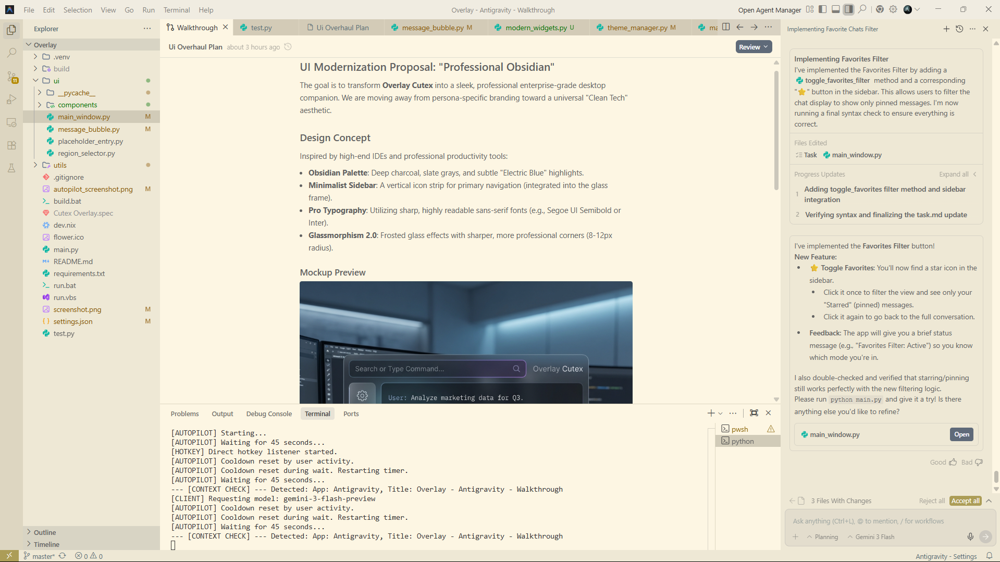

# 🌸 Overlay Cutex (Anna)

**Overlay Cutex** is a premium, glass-morphic AI companion for your Windows desktop. Designed with aesthetics and utility in mind, it provides a transparent overlay to interact with the Gemini AI while you work or play.



## ✨ Core Features

- **🎨 Glassmorphic UI**: A stunning, transparent interface that blends into your workspace.
- **👁️ Context-Aware**: Anna can "see" your active window and selected screen regions to provide relevant assistance.
- **🚀 Autopilot Mode**: An autonomous mode where Anna proactively observes your activity and offers gentle, non-intrusive insights.
- **🎭 Multi-Persona**: Switch between various personalities including Anna, TARS, Holmes, and more.
- **⌨️ Global Hotkeys**: Total control at your fingertips without ever leaving your current app.
- **🌓 Dynamic Themes**: Beautifully crafted Light and Dark modes.

## ⌨️ Hotkeys

| Action | Hotkey |
| :--- | :--- |
| **Show / Hide App** | `Alt + X` |
| **Focus Chat Input** | `Alt + A` |
| **Move Window** | `Alt + Numpad (8, 4, 2, 6)` |
| **Cycle Capture Mode** | `Alt + 0` |
| **Toggle Context Sharing** | `Alt + 5` |
| **Toggle Theme** | `Alt + D` |
| **Increase Opacity** | `Alt + W` |
| **Decrease Opacity** | `Alt + S` |

## 🚀 Getting Started

### Prerequisites
- Python 3.10+
- A Gemini API Key from [Google AI Studio](https://aistudio.google.com/)

### Installation

1. **Clone & Navigate**:
   ```pwsh
   git clone https://github.com/your-username/overlay-cutex.git
   cd overlay-cutex
   ```

2. **Install Dependencies**:
   ```pwsh
   pip install -r requirements.txt
   ```

3. **Configure API Key**:
   Create a `.env` file in the root:
   ```env
   GEMINI_API_KEY=your_key_here
   ```

4. **Run**:
   ```pwsh
   python main.py
   ```

## 🛠️ Built With
- **Python** & **Tkinter**
- **Gemini 2.5 Pro/Flash**
- **pywinstyles** for Windows effects
- **mss** for ultra-fast screen capture

---

*Note: Exclusive Fullscreen applications may require "Borderless Fullscreen" or "Windowed" mode to allow the overlay to appear on top.*