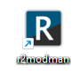

# 🌸 Overlay Cutex (Anna)

**Overlay Cutex** is a premium, glassmorphic AI companion for your Windows desktop. Designed with aesthetics and utility in mind, it provides a transparent overlay to interact with the Gemini AI while you work or play.



## ✨ New & Advanced Features

- **🎨 Glassmorphic UI**: A stunning, transparent interface using Mica/Aero effects.
- **👁️ Context-Aware Highlighting**: Anna "sees" your active window and selected screen regions.
- **🌍 Google Search Grounding**: Connects Anna directly to real-time web search for up-to-date facts and citations.
- **🧠 Long-Term Memory Diaries**: Summarize long conversations into 100-word persona-driven diary entries (`.txt` files) to persist context seamlessly across new sessions.
- **⚡ Async Chat Loading**: Instantly load massive `.json` chat histories without UI freezing via chunked background rendering.
- **🚪 Smart Exit Dialog**: Never lose context; the app proactively prompts you to save your Chat or Memory before quitting.
- **📝 Native Markdown Rendering**: Beautifully formats headers, bold/italic text, lists, and clickable hyperlinks directly in chat bubbles.
- **🚀 Autopilot Engine**: Proactive AI suggests insights based on your activity (Configurable intervals).
- **⚙️ Control Dashboard**: A professional 2-column settings panel for AI, VISUALS, and SHORTCUTS.
- **🖱️ Intuitive Tooltips**: Helpful hover text explains sidebar actions instantly.
- **🔄 UI Controls**: Dedicated buttons to refresh UI and cleanly wipe chat logs.
- **🎭 Multi-Persona**: Switch between various personalities including Anna, TARS, Holmes, and more.
- **⌨️ Global Hotkeys**: Total control at your fingertips without ever leaving your current app.
- **🌓 Dynamic Themes**: Beautifully crafted Light and Dark modes with instant switching.

## ⌨️ Global Hotkeys

| Action | Hotkey |
| :--- | :--- |
| **Show / Hide App** | `Alt + X` |
| **Focus Chat Input** | `Alt + A` |
| **Cycle Capture Mode** | `Alt + 0` |
| **Toggle Context Sync** | `Alt + 5` |
| **Toggle Theme** | `Alt + D` |
| **Increase Opacity** | `Alt + W` |
| **Decrease Opacity** | `Alt + S` |
| **Move Window** | `Alt + Numpad (8, 4, 2, 6)` |

## 🚀 Getting Started

### Prerequisites
- Python 3.10+
- A Gemini API Key from [Google AI Studio](https://aistudio.google.com/)

### Installation

1. **Clone & Navigate**:
   ```pwsh
   git clone https://github.com/your-username/overlay-cutex.git
   cd overlay-cutex
   ```

2. **Install Dependencies**:
   ```pwsh
   pip install -r requirements.txt
   ```

3. **Configure API Key**:
   Create a `.env` file in the root or enter it directly in the app's **Control Dashboard**:
   ```env
   GEMINI_API_KEY=your_key_here
   ```

4. **Run**:
   - Double-click `run.vbs` for a silent background launch.
   - Or run `python main.py` in your terminal.

## 🛠️ Building the Application

To create a standalone `.exe` for distribution:

1. Run the `build.bat` script.
2. The executable will be generated in the `dist/` directory.
3. Ensure `flower.ico` is in the root directory during the build process.

## 🛠️ Built With
- **Python** & **Tkinter**
- **Gemini 3.1/3.0/2.5** (Powered by Google GenAI)
- **pywinstyles** for native Windows glass effects
- **mss** for ultra-fast screen capture

---

*Note: Exclusive Fullscreen applications may require "Borderless Fullscreen" or "Windowed" mode to allow the overlay to appear on top.*